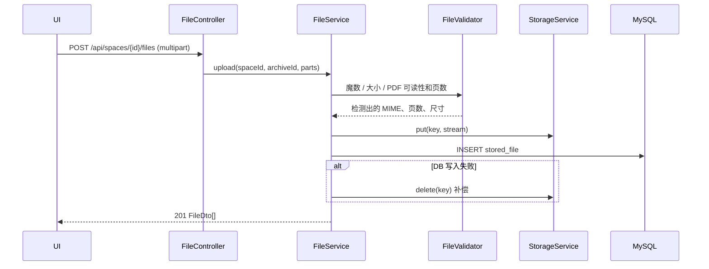
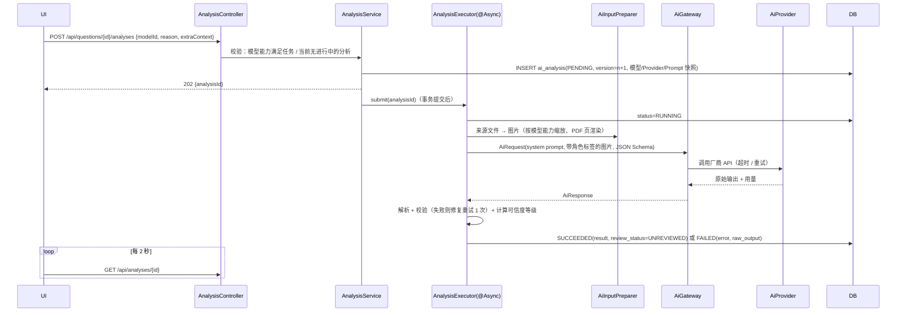
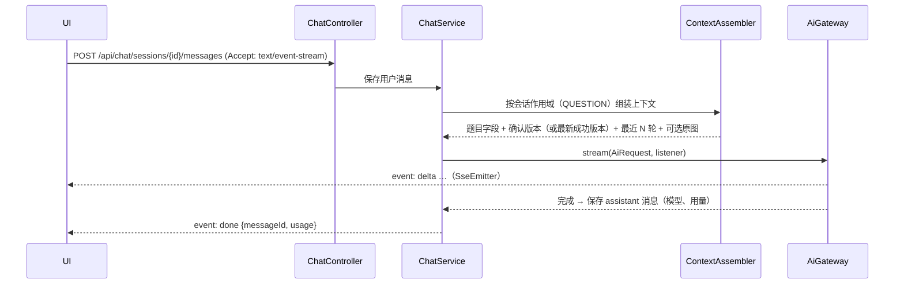

# 02 系统架构设计

## 1. 总体架构

采用**模块化单体**：一个 Spring Boot 应用和一个 Vue 单页应用，外加 MySQL 和本地文件存储。

```
┌──────────────────────────── 浏览器（仅本机） ─────────────────────────────┐
│  Vue 3 SPA（Vite / Element Plus / Pinia / Vue Router）                     │
│  · 页面、Markdown + KaTeX 渲染、上传、SSE 流式对话                          │
└───────────────────────────────┬───────────────────────────────────────────┘
                                │ HTTP /api/**（JSON、multipart、SSE）
┌───────────────────────────────▼───────────────────────────────────────────┐
│ Spring Boot 3.x / Java 21（模块化单体，监听 127.0.0.1:8080）               │
│                                                                           │
│  workspace   archive   file   question   ai   chat   (auth: 预留)         │
│  ───────────────────────── common ────────────────────────                │
│                                                                           │
│  ┌───────────┐   ┌─────────────────┐   ┌────────────────────────────────┐ │
│  │ JPA/Flyway│   │ StorageService  │   │ AiGateway → AiProvider 适配器   │ │
│  └─────┬─────┘   └────────┬────────┘   └───────────────┬────────────────┘ │
└────────┼──────────────────┼────────────────────────────┼──────────────────┘
         ▼                  ▼                            ▼
     MySQL 8          本地文件系统              OpenAI / Anthropic / …（HTTPS）
  （仅元数据）   （原件 + 派生图，可换 S3/MinIO）
```

### 1.1 关键架构决策

| 决策 | 选择 | 理由 |
|---|---|---|
| 应用形态 | 模块化单体 | 规范要求；单用户，没有拆分的必要 |
| 模块边界 | 按业务域分包，模块之间只通过 `*Service` 公共接口调用 | 避免巨型的 controller/service/repository 全局包 |
| AI 调用 | 后端统一经由 `AiGateway`，Provider 适配器可插拔 | 多模型；Key 不出后端 |
| 异步 | Spring `@Async` + 有界线程池 + 数据库状态轮询 | 不引入 MQ 或 Redis；单用户足够 |
| 流式对话 | 同步 Servlet + `SseEmitter` | 不引入 WebFlux |
| 文件 | 元数据放 MySQL，二进制放 `StorageService` | 规范要求；方便以后换对象存储 |
| API 错误格式 | RFC 7807 `ProblemDetail` | Spring 原生支持，状态码语义清晰 |
| 鉴权 | MVP 不做；只监听回环地址 | 用户确认只供个人使用 |

## 2. 仓库结构

```
AI-study/
├─ AGENTS.md                # 项目规范
├─ docs/                    # 本设计文档
├─ backend/                 # Maven，Spring Boot
│  ├─ src/main/java/com/aistudy/...
│  ├─ src/main/resources/
│  │  ├─ db/migration/      # Flyway
│  │  ├─ prompts/           # Prompt 模板（带版本）
│  │  └─ schemas/           # AI 结构化输出的 JSON Schema
│  └─ src/test/...
├─ frontend/                # Vite + Vue 3 + TS
├─ docker-compose.yml       # MySQL 8（开发用）
├─ .env.example
└─ .gitignore               # 包含 .env、存储目录、构建产物
```

> 当前目录还不是 Git 仓库。M0 阶段执行 `git init`。

## 3. 部署形态

| 环境 | 形态 |
|---|---|
| 开发 | `docker compose up mysql`；后端 `mvn spring-boot:run`；前端 `vite`，由开发服务器把 `/api` 代理到 8080（无需 CORS） |
| 个人日常使用（MVP 后） | 方案 A：把前端构建产物打进后端 jar 的 `static/`，只运行一个进程加 MySQL；方案 B：docker compose 运行 app + mysql。**推荐 A**，更简单 |

**网络安全**：`server.address=127.0.0.1`。MVP 不支持局域网或手机直接访问（已确认，README C9）；手机照片先传到电脑再上传。如果以后需要开放访问，必须先加上访问口令（一个简单的 Session 或 Token 过滤器），然后才能改监听地址。

## 4. 关键流程

### 4.1 上传文件



### 4.2 AI 分析（异步）



- 应用启动时，把残留的 `PENDING`/`RUNNING` 记录标记为 `FAILED(INTERRUPTED)`，允许用户重试。
- 线程池：核心 2、最大 4、队列 20；队列满时返回 429。

### 4.3 题目级对话（流式）



前端用 `fetch` 加 `ReadableStream` 解析 SSE（`EventSource` 不支持 POST）。

## 5. 横切关注点

| 关注点 | 设计 |
|---|---|
| 配置 | `application.yml` 加环境变量；`.env.example` 列出所有变量；Key 只从环境变量读取 |
| 错误处理 | 全局 `@RestControllerAdvice` → `ProblemDetail{type,title,status,detail,code,errors[]}`；业务异常统一带 `code`（如 `FILE_TYPE_NOT_ALLOWED`、`MODEL_CAPABILITY_MISMATCH`） |
| 校验 | Controller 边界用 Bean Validation；跨实体规则（同空间、Subject 归属）在 Service 中校验 |
| 事务 | Service 层 `@Transactional`；AI 调用**绝不**放在数据库事务里 |
| 时间 | 数据库 `DATETIME(3)` 存 UTC；Java 用 `Instant`；前端按本地时区显示 |
| 日志 | 每个请求带 `requestId`（MDC）；AI 调用记录 Provider、模型、耗时和 token；**不打印** Key 和图片内容 |
| 空间隔离 | 所有按空间的查询都必须带 `space_id`；通过 ID 访问资源时，Service 校验其所属空间是否与请求路径中的空间一致（防止将来多用户时越权） |
| 备份 | 文档提供 `mysqldump` 加存储目录打包的脚本说明（M7） |

## 6. 技术栈与依赖清单

| 类别 | 依赖 | 引入理由 |
|---|---|---|
| 后端基础 | Spring Web、Validation、Data JPA、Flyway、MySQL Connector | 规范指定 |
| PDF | Apache PDFBox 3.x | 读取页数、按页渲染成图片（07） |
| 图片 | TwelveMonkeys ImageIO（jpeg、webp）、metadata-extractor | 读取 CMYK JPEG 和 WebP；按 EXIF 校正方向（07 §6） |
| AI SDK | `openai-java`、`anthropic-java`（官方 SDK） | 处理鉴权、重试、SSE 和类型；只在各自的适配器包内使用（06 §9） |
| 测试 | JUnit 5、Spring Boot Test、Testcontainers（MySQL）、WireMock | DB 集成测试；用 HTTP 录制测试适配器 |
| 前端基础 | Vue 3、TS、Vite、Element Plus、Vue Router、Pinia | 规范指定 |
| 前端渲染 | `markdown-it`（关闭 html）、`katex` | 渲染 AI 输出中的 Markdown 和数学公式 |
| 前端 HTTP | `axios` | 上传进度回调；统一拦截错误 |

不引入：Spring AI、LangChain4j、WebFlux、Redis、MQ、Tika（文件类型只有 4 种，手写魔数检测就够）。
