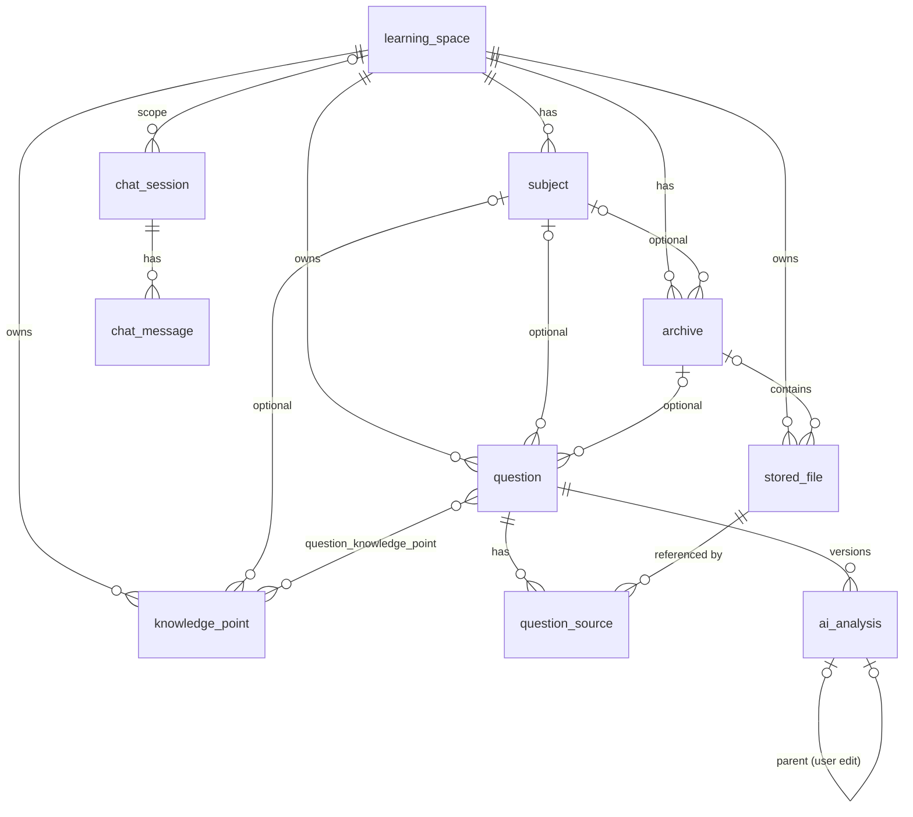

# 03 数据库设计

MySQL 8，`utf8mb4` / `utf8mb4_0900_ai_ci`，InnoDB。表结构由 Flyway 管理。

**约定**

- 主键：`BIGINT AUTO_INCREMENT`。
- 时间：`DATETIME(3)`，存 UTC。
- 枚举：用 `VARCHAR`，在 Java 中映射为 enum（`@Enumerated(STRING)`），方便扩展。
- 软删除：`deleted_at DATETIME(3) NULL`，只用在需要保护的数据上。
- 外键：建立真实的外键约束（单库，数据量小，完整性优先）。
- **不过度范式化**：AI 结构化结果整体存为 JSON，另外只把需要筛选的字段冗余成独立列。

## 1. ER 图



## 2. 表清单

| 表 | 说明 | MVP |
|---|---|---|
| `learning_space` | 学习空间 | ✅ |
| `subject` | 空间下的轻量学科层【R1】 | ✅ |
| `archive` | 归档 | ✅ |
| `stored_file` | 文件元数据（避开 `file` 这个关键字） | ✅ |
| `question` | 题目（含复习预留列【R5】） | ✅ |
| `question_source` | 题目与来源文件/页的关联，带角色 | ✅ |
| `ai_analysis` | AI 分析版本（含模型、Provider、Prompt 版本和审阅状态【R2/R3】） | ✅ |
| `knowledge_point` | 知识点 | ✅ |
| `question_knowledge_point` | 题目与知识点的关联 | ✅ |
| `chat_session` / `chat_message` | 对话 | ✅ |
| `app_user` | 用户 | ❌ 预留设计（见 §5） |
| `review_record` | 复习记录 | ❌ 预留设计（见 §5） |

## 3. 表结构

### 3.1 learning_space

| 列 | 类型 | 约束 | 说明 |
|---|---|---|---|
| id | BIGINT | PK | |
| name | VARCHAR(100) | NOT NULL, UNIQUE | 如「数学一」 |
| description | VARCHAR(500) | NULL | |
| color | VARCHAR(20) | NULL | 界面标识色，例如 `#409EFF` |
| ai_profile | VARCHAR(50) | NOT NULL, 默认 `generic` | AI 分析配置键：`math` / `cs408` / `generic`……对应 Prompt 模板目录（06 §6） |
| ai_instructions | TEXT | NULL | 空间级附加 AI 指令（用户可编辑） |
| sort_order | INT | NOT NULL 默认 0 | |
| archived_at | DATETIME(3) | NULL | 归档（隐藏），不删除 |
| created_at / updated_at | DATETIME(3) | NOT NULL | |

> 预留：将来加入多用户时，新增 `owner_id` 并把 UNIQUE 改为 `(owner_id, name)`。其余表都通过 `space_id` 间接归属用户，不需要改动。

### 3.2 subject【评审 R1】

| 列 | 类型 | 约束 | 说明 |
|---|---|---|---|
| id | BIGINT | PK | |
| space_id | BIGINT | FK → learning_space, NOT NULL | |
| name | VARCHAR(100) | NOT NULL | 如「操作系统」 |
| ai_instructions | TEXT | NULL | Subject 级附加 AI 指令，拼接在空间指令之后 |
| sort_order | INT | NOT NULL 默认 0 | |
| archived_at | DATETIME(3) | NULL | 停用后不在下拉框中出现，已有引用保持不变 |
| created_at / updated_at | DATETIME(3) | NOT NULL | |

- 唯一约束：`UNIQUE(space_id, name)`
- 删除规则：只能删除没有被引用的 Subject；被引用的只能停用（`archived_at`）。
- **一致性规则**（Service 层校验）：`archive.subject_id`、`question.subject_id`、`knowledge_point.subject_id` 指向的 Subject 必须与记录的 `space_id` 相同。

### 3.3 archive

| 列 | 类型 | 约束 | 说明 |
|---|---|---|---|
| id | BIGINT | PK | |
| space_id | BIGINT | FK, NOT NULL | |
| subject_id | BIGINT | FK → subject, NULL | 可选 |
| name | VARCHAR(200) | NOT NULL | 如「2023 真题」 |
| description | VARCHAR(1000) | NULL | |
| created_at / updated_at | DATETIME(3) | NOT NULL | |
| deleted_at | DATETIME(3) | NULL | 只能删除空归档 |

索引：`(space_id, deleted_at, created_at)`

### 3.4 stored_file

| 列 | 类型 | 约束 | 说明 |
|---|---|---|---|
| id | BIGINT | PK | 内部唯一 ID |
| space_id | BIGINT | FK, NOT NULL | 所属空间 |
| archive_id | BIGINT | FK, NULL | 可选的归档 |
| original_filename | VARCHAR(255) | NOT NULL | 原始文件名（只用于显示） |
| mime_type | VARCHAR(100) | NOT NULL | **服务端检测**得到的类型 |
| declared_mime_type | VARCHAR(100) | NULL | 客户端声明的类型（只做记录） |
| extension | VARCHAR(10) | NOT NULL | 由检测类型决定，例如 `jpg`/`png`/`webp`/`pdf` |
| size_bytes | BIGINT | NOT NULL | |
| sha256 | CHAR(64) | NOT NULL | 完整性校验和重复提示 |
| storage_backend | VARCHAR(20) | NOT NULL | `local`（以后可能是 `s3`/`minio`/`oss`） |
| storage_key | VARCHAR(500) | NOT NULL, UNIQUE | 存储位置（相对键，不是绝对路径） |
| page_count | INT | NULL | PDF 的页数；图片为 NULL |
| width / height | INT | NULL | 图片像素尺寸（按 EXIF 方向校正后） |
| created_at | DATETIME(3) | NOT NULL | 上传时间 |
| deleted_at | DATETIME(3) | NULL | 软删除 |

索引：`(space_id, archive_id, created_at)`、`(space_id, sha256)`

### 3.5 question（含复习预留字段【评审 R5】）

| 列 | 类型 | 约束 | 说明 |
|---|---|---|---|
| id | BIGINT | PK | |
| space_id | BIGINT | FK, NOT NULL | |
| subject_id | BIGINT | FK, NULL | 可选 |
| archive_id | BIGINT | FK, NULL | 主要来源归档（默认取第一个来源文件所在的归档） |
| title | VARCHAR(200) | NULL | 列表显示用；默认取「位置提示」或题干的前若干字 |
| locate_hint | VARCHAR(200) | NULL | 「第 3 题」「左下角那题」 |
| stem_text | TEXT | NULL | **用户确认后**的题干（Markdown + LaTeX） |
| user_answer_text | TEXT | NULL | 用户输入或确认的解答 |
| official_answer_text | TEXT | NULL | 标准答案 |
| user_context | TEXT | NULL | 补充说明（例如「这题我卡在换元」） |
| status | VARCHAR(20) | NOT NULL 默认 `ACTIVE` | `ACTIVE` / `ARCHIVED` |
| latest_analysis_id | BIGINT | NULL | 最新一个分析版本（任意状态），用于列表显示进度 |
| confirmed_analysis_id | BIGINT | NULL | **当前确认版本**【R3】 |
| error_type | VARCHAR(30) | NULL | 冗余自确认版本，用于筛选 |
| **mastery_level** | TINYINT | NULL | 🔒 预留：掌握程度 0–5 |
| **review_count** | INT | NOT NULL 默认 0 | 🔒 预留：复习次数 |
| **last_reviewed_at** | DATETIME(3) | NULL | 🔒 预留 |
| **next_review_at** | DATETIME(3) | NULL | 🔒 预留：下次复习时间 |
| created_at / updated_at | DATETIME(3) | NOT NULL | |
| deleted_at | DATETIME(3) | NULL | 软删除 |

索引：`(space_id, deleted_at, created_at)`、`(space_id, subject_id)`、`(space_id, error_type)`

**🔒 复习预留字段的约束（R5）：**

- 在 V1 迁移中建列，保证将来开发复习功能时不需要改动大表结构。
- JPA 实体中**不映射**这四列（或映射为只读且不暴露），也**不出现**在任何 DTO、API 或 UI 中，不写任何业务逻辑。
- `next_review_at` 的索引到开发复习功能时再建。
- 复习系统启用时，只针对有 `confirmed_analysis_id` 的题目（见 01 §5.2）。

### 3.6 question_source

| 列 | 类型 | 约束 | 说明 |
|---|---|---|---|
| id | BIGINT | PK | |
| question_id | BIGINT | FK, NOT NULL | |
| file_id | BIGINT | FK → stored_file, NOT NULL | |
| page_no | INT | NULL | PDF 页码（从 1 开始）；图片为 NULL |
| role | VARCHAR(30) | NOT NULL | `QUESTION` / `USER_WORK` / `OFFICIAL_SOLUTION` / `MIXED` / `REFERENCE` |
| region | JSON | NULL | 预留：框选区域 `{x,y,w,h}`（相对坐标 0–1），MVP 不用 |
| sort_order | INT | NOT NULL | 发送给 AI 的顺序 |

- 唯一约束：`UNIQUE(question_id, file_id, page_no)`（`page_no` 为 NULL 时由应用层保证唯一）
- 规则：来源文件必须与题目在同一空间；每道题最多 **6** 个来源（与 07 §4 一致）。

### 3.7 ai_analysis【评审 R2 / R3】

| 列 | 类型 | 约束 | 说明 |
|---|---|---|---|
| id | BIGINT | PK | |
| question_id | BIGINT | FK, NOT NULL | |
| version_no | INT | NOT NULL | 每道题内递增 |
| origin | VARCHAR(20) | NOT NULL | `AI` / `USER_EDIT` |
| parent_id | BIGINT | FK → ai_analysis, NULL | 用户修正时指向原版本 |
| trigger_reason | VARCHAR(30) | NOT NULL | `INITIAL` / `USER_REQUEST` / `INFO_ADDED` / `MODEL_CHANGE` / `PROMPT_CHANGE` / `RETRY` |
| status | VARCHAR(20) | NOT NULL | `PENDING` / `RUNNING` / `SUCCEEDED` / `FAILED` |
| review_status | VARCHAR(20) | NULL | `UNREVIEWED` / `CONFIRMED` / `CORRECTED` / `REJECTED`（只对 SUCCEEDED 有效） |
| reviewed_at | DATETIME(3) | NULL | |
| review_note | VARCHAR(1000) | NULL | 驳回原因或修正说明 |
| **provider_id** | VARCHAR(50) | NULL | 配置中的 Provider 标识，例如 `openai`、`anthropic`（`USER_EDIT` 版本为 NULL） |
| **provider_type** | VARCHAR(50) | NULL | 适配器类型，例如 `openai-responses`、`anthropic-messages` |
| **model_id** | VARCHAR(100) | NULL | 系统内的模型配置 ID，例如 `claude-main` |
| **model_name** | VARCHAR(100) | NULL | 请求时使用的厂商模型名 |
| **model_version** | VARCHAR(100) | NULL | 厂商响应中返回的实际模型标识（如果有） |
| **prompt_key** | VARCHAR(100) | NULL | 例如 `math/question-analysis` |
| **prompt_version** | VARCHAR(20) | NULL | 例如 `v1` |
| **prompt_hash** | CHAR(64) | NULL | 渲染前模板内容的 SHA-256，用来发现「改了模板却没升版本」 |
| **schema_version** | VARCHAR(50) | NOT NULL | 例如 `question-analysis/v1` |
| input_snapshot | JSON | NULL | 输入快照：来源列表（fileId、page、role、sha256）、文本字段、附加指令、预处理参数、模型能力快照 |
| result | JSON | NULL | 校验通过的结构化结果（06 §5） |
| raw_output | MEDIUMTEXT | NULL | 原始输出（校验失败或调试时保存） |
| confidence | DECIMAL(3,2) | NULL | 模型自报的可信度 0–1 |
| confidence_level | VARCHAR(10) | NULL | 系统综合得出的等级 `HIGH` / `MEDIUM` / `LOW`（06 §7） |
| confidence_signals | JSON | NULL | 命中的可信度信号，例如 `["unreadableHigh","repaired"]`，界面据此解释原因 |
| error_type | VARCHAR(30) | NULL | 冗余自 result |
| error_code / error_message | VARCHAR(50) / VARCHAR(1000) | NULL | 失败原因 |
| input_tokens / output_tokens | INT | NULL | 用量 |
| latency_ms | INT | NULL | |
| created_at / started_at / finished_at | DATETIME(3) | | |

- 唯一约束：`UNIQUE(question_id, version_no)`
- 索引：`(question_id, created_at)`、`(status)`（启动时恢复用）
- **不可变规则**：`SUCCEEDED` 版本的 `result` 和元数据一旦写入就不能再改，只能修改 `review_status`、`reviewed_at` 和 `review_note`。
- 并发规则：同一道题同时只能有一个 `PENDING`/`RUNNING` 版本。

### 3.8 knowledge_point

| 列 | 类型 | 约束 | 说明 |
|---|---|---|---|
| id | BIGINT | PK | |
| space_id | BIGINT | FK, NOT NULL | |
| subject_id | BIGINT | FK, NULL | 可选 |
| name | VARCHAR(100) | NOT NULL | |
| normalized_name | VARCHAR(100) | NOT NULL | 去掉空白和全半角差异、转小写后的名称，用于去重和匹配 |
| description | VARCHAR(500) | NULL | |
| source | VARCHAR(10) | NOT NULL | `AI` / `USER`（创建来源） |
| created_at / updated_at | DATETIME(3) | NOT NULL | |

唯一约束：`UNIQUE(space_id, normalized_name)`

### 3.9 question_knowledge_point

| 列 | 类型 | 约束 | 说明 |
|---|---|---|---|
| question_id | BIGINT | PK, FK | |
| knowledge_point_id | BIGINT | PK, FK | |
| source | VARCHAR(10) | NOT NULL | `AI`（确认分析时勾选）/ `USER`（手动添加） |
| analysis_id | BIGINT | FK, NULL | 来自哪个确认版本 |
| created_at | DATETIME(3) | NOT NULL | |

索引：`(knowledge_point_id)`

> 关联只在「确认」或「手动添加」时写入。未确认的 AI 草稿里的知识点只存在于 `ai_analysis.result` 中。

### 3.10 chat_session

| 列 | 类型 | 约束 | 说明 |
|---|---|---|---|
| id | BIGINT | PK | |
| scope_type | VARCHAR(20) | NOT NULL | `GLOBAL` / `SPACE` / `ARCHIVE` / `QUESTION`（MVP 只用 `QUESTION`） |
| space_id | BIGINT | FK, NULL | `GLOBAL` 时为 NULL |
| scope_ref_id | BIGINT | NULL | archive_id 或 question_id（多态引用，由应用层校验） |
| title | VARCHAR(200) | NULL | |
| default_model_id | VARCHAR(100) | NULL | |
| created_at / updated_at | DATETIME(3) | NOT NULL | |
| deleted_at | DATETIME(3) | NULL | |

索引：`(scope_type, scope_ref_id, updated_at)`、`(space_id, updated_at)`

### 3.11 chat_message

| 列 | 类型 | 约束 | 说明 |
|---|---|---|---|
| id | BIGINT | PK | |
| session_id | BIGINT | FK, NOT NULL | |
| role | VARCHAR(20) | NOT NULL | `USER` / `ASSISTANT` |
| content | MEDIUMTEXT | NOT NULL | |
| attachments | JSON | NULL | `[{type:"file",fileId,page},{type:"question",id}]`；MVP 只记录「是否附带原图」 |
| status | VARCHAR(20) | NOT NULL | `COMPLETED` / `STREAMING` / `FAILED` / `CANCELLED` |
| provider_id / model_id / model_name | VARCHAR | NULL | 只有 ASSISTANT 消息记录 |
| prompt_key / prompt_version | VARCHAR | NULL | 对话系统 Prompt 的版本 |
| context_snapshot | JSON | NULL | 实际使用的上下文摘要：分析版本 ID、历史轮数、是否附带原图 |
| input_tokens / output_tokens | INT | NULL | |
| error_message | VARCHAR(1000) | NULL | |
| created_at | DATETIME(3) | NOT NULL | |

索引：`(session_id, id)`

## 4. 迁移策略

- Flyway 脚本放在 `backend/src/main/resources/db/migration`，命名为 `V{n}__{desc}.sql`，按里程碑增量编写：
  - `V1__learning_space_subject.sql`（M1）
  - `V2__archive_file.sql`（M2）
  - `V3__question.sql`（M3，**包含复习预留列**）
  - `V4__ai_analysis_knowledge_point.sql`（M4）
  - `V5__chat.sql`（M6）
- 已发布的脚本不能修改，只能追加新脚本。
- 测试使用 Testcontainers MySQL 执行全部迁移，保证和生产方言一致（不用 H2）。

## 5. 预留设计（不建表）

### 5.1 app_user（登录功能启用时）

```
app_user(id, username UNIQUE, password_hash, created_at)
learning_space.owner_id → app_user.id
```

### 5.2 review_record（复习系统启用时）【R5】

```
review_record(
  id, question_id FK, reviewed_at,
  result VARCHAR(20)      -- AGAIN / HARD / GOOD / EASY
  mastery_before, mastery_after,
  next_review_at,          -- 由调度算法（如 SM-2 简化版）计算
  note
)
```

启用时回填 `question.mastery_level / review_count / last_reviewed_at / next_review_at`（冗余列，方便查询「今日待复习」），并为 `next_review_at` 建立索引。
